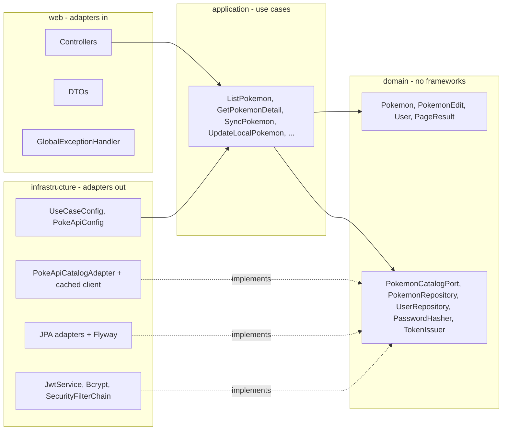
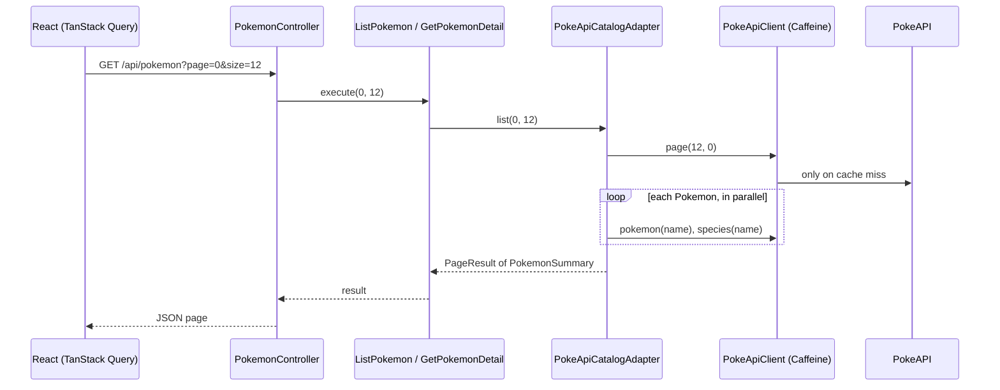
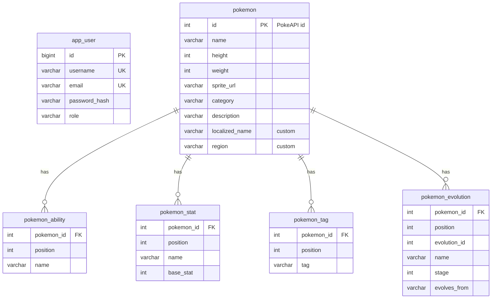

# Architecture

## Layers and dependency rule



The rule "source code dependencies only point inwards" is not just a convention: [`ArchitectureTest`](../backend/src/test/java/com/ballastlane/pokedex/ArchitectureTest.java) fails the build when
`domain` or `application` import Spring/Jakarta/Jackson, or when `application` touches `infrastructure`/`web`, or when `web` and `infrastructure` depend on each other.

## Request flows

### US01/US02 - browsing (public, read-through cache)



The list needs two upstream calls per Pokemon (stats/abilities and species/category), so the adapter fetches them in parallel and every response is cached for one hour. A warm page is served without touching PokeAPI.

### US03/US04 - local replication and edits (JWT)

`SyncPokemon` fetches the remote Pokemon through the catalog port and stores it through the repository port, refusing duplicates (409). `UpdateLocalPokemon` loads the aggregate, applies a `PokemonEdit` through `Pokemon.applyPartial` (PATCH) or `Pokemon.replaceWith` (PUT) and saves it. Because `Pokemon` validates its invariants in the constructor, an invalid edit can never reach the database, and the same rules protect data coming from PokeAPI, from the database and from clients.

## Data model



- The **primary entity** is `pokemon` (PK = PokeAPI id) with a secondary collection (abilities, stats, tags, evolutions). `app_user` supports user management.
- `localized_name`, `region` and `tags` are the proprietary fields that justify replicating Pokemon locally.
- Schema is owned by Flyway (`db/migration`), Hibernate only validates it (`ddl-auto: validate`). Demo data lives in `db/seed` so test runs start from an empty schema.

## Decisions and trade-offs

| Decision | Reason | Trade-off |
| --- | --- | --- |
| Use cases are plain classes wired in `UseCaseConfig` | Keeps `application` free of Spring so the architecture test can enforce it | A little wiring boilerplate |
| Domain validation inside `Pokemon` (compact constructor) | Single place for business rules; reused by sync, PUT and PATCH | Errors are raised as exceptions, translated to 400 by the web layer |
| `PokemonEdit` for both PUT and PATCH | One edit model; PUT = replace all editable fields (missing custom fields are cleared), PATCH = only provided fields | Needs `replaceWith` and `applyPartial` |
| Cache on the HTTP client (not the adapter) | `@Cacheable` works through Spring proxies, so it sits on a bean called from another bean | Caches raw JSON, not domain objects |
| JSON mapped manually (`JsonNode`) | PokeAPI payloads are huge, we need ~10 fields; avoids dozens of DTO classes | Mapper tests with fixtures protect against upstream changes |
| JWT stateless auth, BCrypt hashes | No server session, easy to scale; passwords never stored in clear | No token revocation (short-lived tokens, 2h) |
| Local API requires auth, catalog is public | Matches "protected versus public routes" in the brief | - |
| Pagination is capped (50 remote / 100 local) | Prevents expensive fan-out calls to PokeAPI | Clients must page |
| 502 for upstream failures | Makes it obvious the fault is not the client's | Internal error details are logged, not returned |
| Frontend uses same-origin `/api` (Vite proxy, nginx proxy) | No CORS in dev or Docker | CORS is still configured for direct calls |

## Frontend structure

```text
src/
  app/        providers, router, layout, query client
  features/
    auth/     login, register, session provider, protected route
    pokemon/  catalog list, detail, evolution chain, stat bars, query hooks
    local/    my pokemon list, edit form (+ pure validation in form.ts), mutation hooks
  shared/     http client (ApiError), token storage, UI primitives, formatting
  test/       MSW server, fixtures, render helper
```

State management: **server state** lives in TanStack Query (keys per feature, invalidated on mutations, `keepPreviousData` for flicker-free pagination); the only **client state** is the session (external store read through `useSyncExternalStore`) and local form state. A 401 on an authenticated call clears the session so the UI falls back to the login page.
